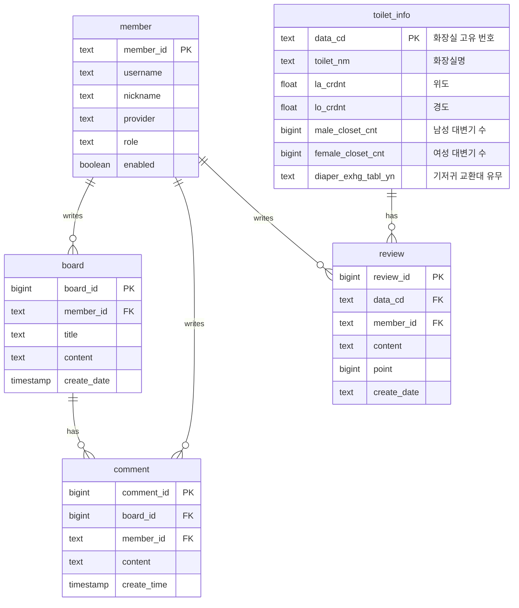

<div align="center">
  
# 🚽 PEECE MAKER (피스메이커)
**PEECE MAKER**는 제주도 여행객과 도민을 위한 **제주시 공중화장실 위치 탐색 및 커뮤니티 플랫폼**입니다. 제주시 내 공중화장실의 위치와 편의시설 정보를 직관적으로 제공하고, 이용자들이 리뷰를 공유할 수 있는 커뮤니티 조성을 목표로 합니다.

[🎬 시연 영상 보기 (Google Drive)](https://drive.google.com/file/d/13tFW-Ujd-TiHFeiQlXoA7XbLkdLOUBF5/view?usp=drive_link)
</div>

<br/>

## 🛠 기술 스택 (Tech Stack)

### 🎨 Frontend
  
   

### 🗄️ Database (BaaS)
 

### 🔐 Authentication & API
  

<br/>

## ☁️ 아키텍처 및 데이터베이스 흐름 (Architecture & DB Flow)

본 서비스는 물리적인 서버 인프라를 직접 운용하지 않는 **Serverless + BaaS(Backend as a Service)** 아키텍처로 구성되어 있으며, 최신 웹 개발 패러다임을 따라 데이터 로딩 및 상태 관리를 최적화했습니다.

- **Vercel (Serverless Edge)**: `Next.js` 애플리케이션의 호스팅 및 서버 사이드 렌더링(SSR)을 담당하며, 사용자 요청 시에만 실행되는 서버리스 함수(Serverless Functions)를 통해 인터랙티브 UI와 API 라우트를 처리합니다.
- **Supabase (PostgreSQL BaaS)**:
  - **데이터베이스 (PostgreSQL)**: 제주도 공중화장실 좌표 및 부가 정보 데이터를 안전한 관계형 테이블 구조로 구축하여 지연 시간 없이 브라우저 지도로 전달합니다.
  - **인증 (Authentication)**: 구글, 깃허브 기반의 OAuth 접근을 관리하며 쿠키를 기반으로 SSR에서도 끊김 없는 사용자 세션 유지 기능을 제공합니다.
  - **보안 (Row Level Security)**: RLS(행 수준 보안) 정책이 부여되어 커뮤니티 게시판의 악의적인 접근을 완벽히 차단하며, 인가된 작성자 본인만이 자신의 게시글 및 댓글을 삭제/수정할 수 있도록 데이터베이스 단에서 통제합니다.
- **TanStack React Query**: 클라이언트 사이드에서 상태 관리를 전담하며, 데이터 캐싱을 통해 DB 호출을 최적화하고 속도를 향상시킵니다.

<br/>

## 🗂️ 데이터베이스 구조 (ERD)

Supabase(PostgreSQL) 기반의 관계형 데이터베이스 구조입니다.



<br/>

## ✨ 핵심 서비스 기능 (Key Features)

- **화장실 지도 (Toilet Map)**: 카카오맵을 기반으로 사용자 주변의 공중화장실 위치를 실시간으로 탐색하며, 안심시설 및 편의시설 조건별 스마트 필터링을 지원합니다.
- **통계 대시보드 (Data Dashboard)**: 제주시 공공데이터를 시각화하여 읍/면/동별 화장실 분포 및 편의시설 수용력 현황을 반응형 차트(Recharts)로 제공합니다.
- **커뮤니티 게시판 (Community Board)**: 여행객과 도민이 화장실 이용 꿀팁이나 청결 상태 등 현장 정보를 실시간으로 공유하고 소통할 수 있는 공간입니다.
- **소셜 로그인 (OAuth)**: 로컬 로그인과 함께 별도의 복잡한 절차 없이 구글 및 깃허브 계정을 통한 빠른 회원가입 및 안전한 인증 환경을 제공합니다.

<br/>

## 💡 주요 기술 도입 배경 (Tech Stack & Background)

본 프로젝트는 최신 React 생태계를 적극 활용하여 구축되었으며, 클라이언트 성능 최적화와 개발 생산성을 고려하여 기술 스택을 선정했습니다.

### 1. 전역 상태 및 데이터 패칭 (TanStack React Query)
- **도입 배경**: 게시판 목록, 화장실 정보 등 비동기 조회 위주의 데이터가 빈번하게 요청됩니다. 불필요한 중복 호출을 줄이고 데이터 최신화를 효율적으로 관리할 필요가 있었습니다.
- **적용 결과**: 데이터 캐싱을 통해 지도 필터링이나 페이지 이동 시 발생하는 대기 시간을 없앴으며, 커뮤니티 게시판의 동적인 렌더링 속도를 크게 향상시켰습니다.

### 2. 대량의 DOM 렌더링 최적화 (Kakao Map Clusterer)
- **도입 배경**: 수천 개의 화장실 위치 마커를 지도 상에 한 번에 렌더링할 경우, 브라우저 메모리 점유율이 높아지고 드래그 성능이 저하되는 이슈가 있습니다.
- **적용 결과**: `react-kakao-maps-sdk`의 `MarkerClusterer`를 도입하여 지도 축척(Zoom) 레벨에 따라 인접한 마커들을 동적으로 그룹화했습니다. 이를 통해 DOM 병목을 해소하고 원활한 지도 탐색이 가능해졌습니다.

### 3. 서버리스 데이터베이스 및 보안 제어 (Supabase RLS)
- **도입 배경**: 별도의 서버 구축 없이 사용자 인증과 관계형 DB(PostgreSQL)를 연동하고, 동시에 데이터 접근 권한을 안전하게 통제해야 했습니다.
- **적용 결과**: Google, GitHub 기반의 OAuth 소셜 로그인을 구축했습니다. 특히 **RLS(Row Level Security)** 정책을 데이터베이스에 거울처럼 적용하여, 클라이언트에서 API를 강제 변조하더라도 작성자 본인이 아니면 게시글이나 댓글을 수정/삭제할 수 없도록 원천 차단했습니다.

### 4. 데이터 시각화 (Recharts)
- **도입 배경**: 행정명/수용량 단위의 정적인 텍스트 데이터를 사용자가 직관적으로 이해할 수 있는 통계 화면으로 변환하고자 했습니다.
- **적용 결과**: React에 최적화된 SVG 기반 차트 라이브러리인 `Recharts`를 도입해, 안심/편의시설 필터링 조작 즉시 애니메이션과 함께 차트가 재계산되는 대시보드를 구축했습니다.

### 5. 선언적 애니메이션 (Framer Motion)
- **도입 배경**: 사용자의 액션(팝업 트리거, 탭 전환)에 즉각적인 피드백을 주고 화면 전환 간의 맥락을 부드럽게 이어줄 장치가 필요했습니다.
- **적용 결과**: React 컴포넌트 생명주기와 완벽하게 호환되는 `Framer Motion`(`AnimatePresence`)을 활용해 리스트 언마운트 시의 자연스러운 페이드아웃 효과 등을 구현했습니다.

<br/>

## 📁 주요 데이터 출처 (Data Source)

**제주특별자치도 제주시_공중화장실 (공공데이터포털)**
* **제공 기관**: 제주특별자치도 제주시
* **데이터 내용**: 위경도 좌표, 비상벨·CCTV 설치 유무, 개방 시간, 편의시설 세부 현황 등
* 🔗 [공공데이터 원본 확인하기](https://www.data.go.kr/data/15110521/fileData.do)

<br/>

## 🚀 로컬 환경 실행 가이드 (Getting Started)

### 사전 요구사항 (Prerequisites)
* **Node.js**: v20 이상 권장
* **패키지 매니저**: npm, yarn, pnpm 중 택 1

### 1. 저장소 클론 및 패키지 설치
```bash
git clone https://github.com/nx2803/PeeceMaker.git
cd PeeceMaker
npm install
```

### 2. 환경 변수 설정
프로젝트 최상단 루트 디렉토리에 `.env.local` 파일을 생성하고 아래의 키값들을 입력합니다.
```env
# Supabase 계정 설정 (필수)
NEXT_PUBLIC_SUPABASE_URL=your_supabase_project_url
NEXT_PUBLIC_SUPABASE_ANON_KEY=your_supabase_anon_key

# Kakao Map API 키 (필수)
NEXT_PUBLIC_KAKAO_MAP_KEY=your_kakao_map_api_key
```

### 3. 개발 서버 실행
```bash
npm run dev
```
브라우저에서 `http://localhost:3000`에 접속하여 서비스를 이용하실 수 있습니다!

### 🐳 Docker를 이용한 배포 (Docker Deployment)
**Docker Multi-stage 빌드**와 Next.js `standalone` 모드를 적용하여 컨테이너 이미지 용량을 최소화한 최적화 배포를 지원합니다.

```bash
# 1. 도커 이미지 빌드
docker build -t peecemaker .

# 2. 도커 컨테이너 실행 (환경변수 파일 포함)
docker run -d -p 3000:3000 --env-file .env.local peecemaker
```
컨테이너가 실행되면 `http://localhost:3000`에서 프로덕션 최적화된 앱을 테스트 및 운영하실 수 있습니다.

<br/>

## 🏗 프로젝트 폴더 구조 (Directory Structure)
```text
PeeceMaker/
 ┣ public/               # 정적 파일 (제주 영상, 이미지, 글로벌 폰트 등)
 ┣ src/
 ┃ ┣ app/                # Next.js 16 App Router 기반 메인 로직
 ┃ ┃ ┣ auth/             # Supabase Auth 콜백 및 에러 핸들링
 ┃ ┃ ┣ login/            # 소셜 및 이메일 로그인 페이지
 ┃ ┃ ┣ main/             # 서비스 핵심 페이지 모음 (Map, Chart, Board)
 ┃ ┃ ┣ signin/           # 회원가입 전용 페이지
 ┃ ┃ ┣ globals.css       # Tailwind 4.0 전역 스타일 및 유틸리티
 ┃ ┃ ┗ page.tsx          # 애플리케이션 진입 랜딩 뷰 (Intro)
 ┃ ┣ utils/              # 유틸리티 함수 및 설정 파일
 ┃ ┃ ┗ supabase/         # Supabase 클라이언트 및 미들웨어 통합 설정
 ┃ ┗ proxy.ts            # Next.js 16 라우팅/세션 검사 프록시 (Middleware 대체)
 ┗ tailwind.config.ts    # 테일윈드 환경 설정
```

<br/>


